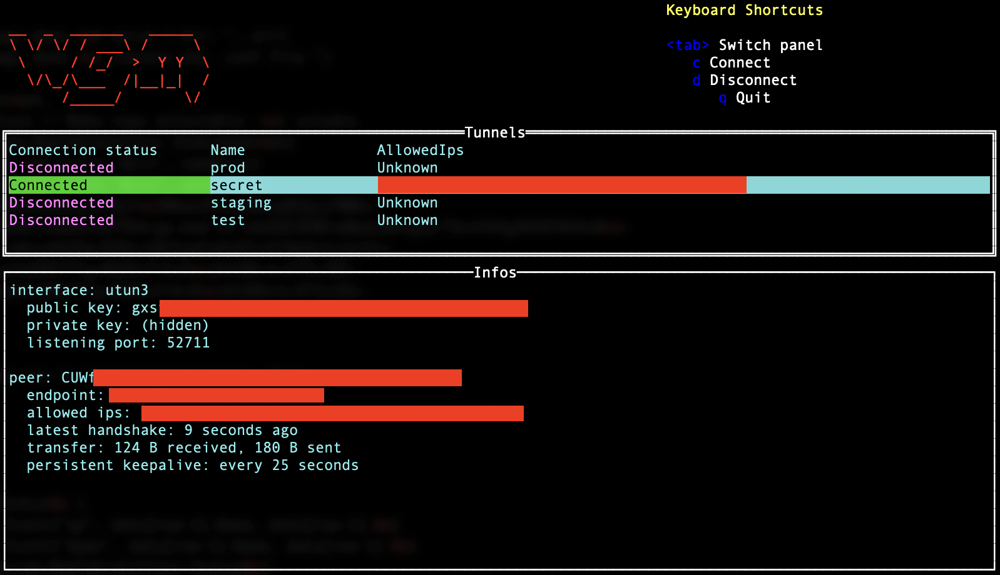

# Wireguard-manager

Wireguard-manager is a command-line GUI that facilitates the connection and
disconnection from multiple Wireguard tunnels.

## Features
- Instantly see the status of all your Wireguard tunnels at a glance.
- Easily connect or disconnect to Wireguard tunnels.
- Command-line interface with a simple-to-use GUI.

## Installation

1. Install `wg` and `wg-quick` binaries (eg. `brew install wireguard-tools`,
   `apt-get install wireguard`).
2. Place your Wireguard configuration files (`.conf` files) in your `$HOME/.wg`
   directory.
3. Download and install the `wgm` binary.

## Usage

Execute the `wgm` command in your terminal:

- Navigate between tunnels using the arrow keys or `j` & `k`.
- Press `c` to connect to the highlighted tunnel.
- Press `d` to disconnect from the highlighted tunnel.
- Press `q` to exit the software.

**Note**: Wireguard tunnels will continue to run in the background even after
exiting Wireguard-manager. Relaunching the tool will display the status of each
tunnel, allowing you to reconnect or disconnect as needed.

## Contribution

If you're interested in contributing to the development of Wireguard-manager,
feel free to raise issues or submit pull requests directly.
